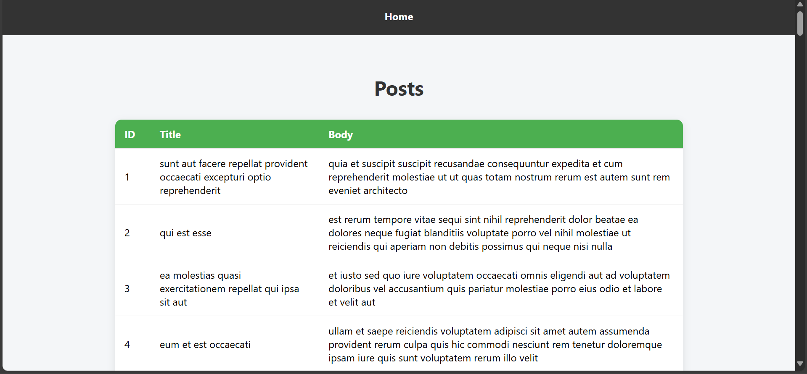

# Experiment 14: Fetch Data from Public REST API
## Screenshots

Here’s a preview of the app:



## 🎯 Objective
To fetch data from a **public REST API** (JSONPlaceholder) using `axios` or `fetch`, display it in a **table**, and handle **loading** and **error** states.

---

## 🛠️ Steps Followed

1. **Created React App**
   ```bash
   npx create-react-app react-api-table
   cd react-api-table
